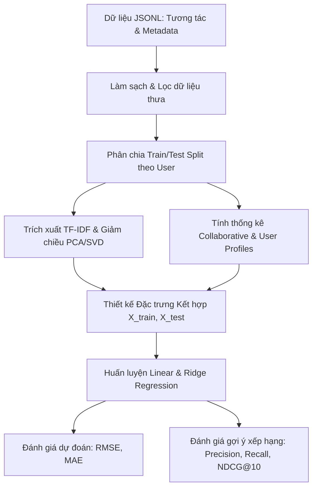
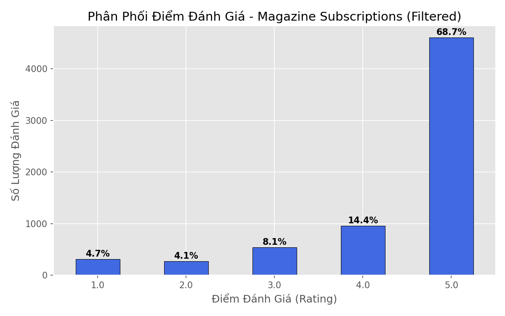
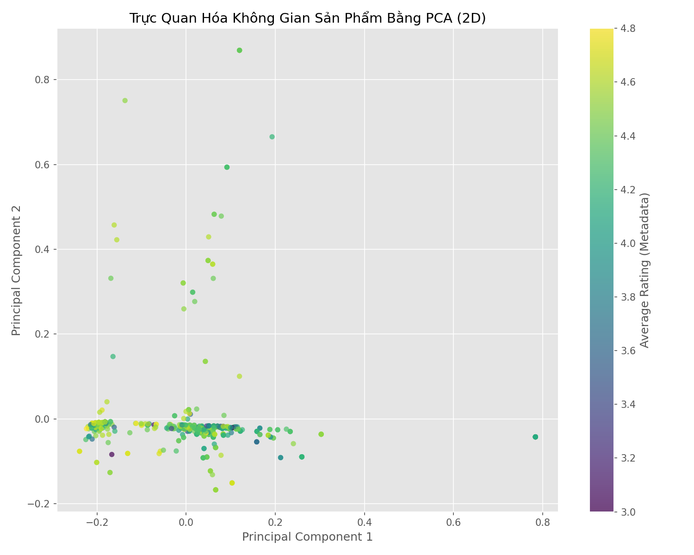
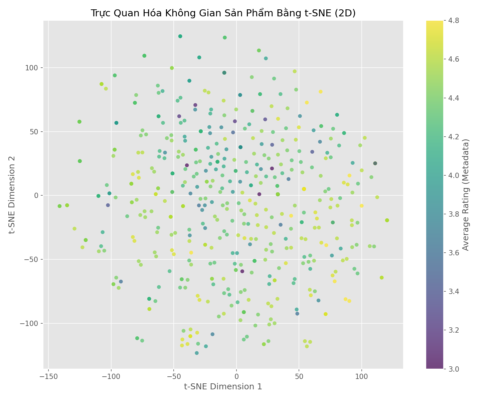

# Báo Cáo Nghiên Cứu & Thực Nghiệm Học Máy: Hệ Thống Gợi Ý Sản Phẩm Thương Mại Điện Tử Sử Dụng Hồi Quy Tuyến Tính (Linear/Ridge Regression)

Tài liệu này trình bày chi tiết toàn bộ cơ sở lý thuyết, quy trình thiết kế, thực nghiệm và kết quả đánh giá cho dự án **Xây dựng Hệ thống Gợi ý Sản phẩm Tạp chí (Magazine Subscriptions Recommendation System)** sử dụng mô hình **Hồi quy Tuyến tính (Linear Regression)** và **Hồi quy Ridge (Ridge Regression)** kết hợp giảm chiều biểu diễn văn bản.

---

## 1. Introduction (Giới thiệu & Động lực)

### 1.1. Nội dung đề tài
Trong kỷ nguyên số, hệ thống gợi ý (Recommender Systems) đã trở thành một phần cốt lõi của các nền tảng thương mại điện tử (như Amazon, Netflix, Shopee). Hệ thống phân tích hành vi và sở thích của khách hàng để đưa ra các đề xuất sản phẩm mang tính cá nhân hóa cao. 

Dự án này tập trung vào việc dự đoán mức độ quan tâm của người dùng đối với các ấn phẩm tạp chí bằng cách sử dụng bộ dữ liệu **Amazon Magazine Subscriptions** (bao gồm thông tin tương tác của người dùng và metadata mô tả chi tiết của sản phẩm).

### 1.2. Bài toán Machine Learning trong đề tài
Bài toán cốt lõi được định nghĩa trong đề tài này là bài toán **Hồi quy giám sát (Supervised Regression)**. 
- **Mục tiêu:** Dự đoán một giá trị liên tục - điểm đánh giá (Rating) từ $1.0$ đến $5.0$ - mà một người dùng cụ thể sẽ dành cho một sản phẩm tạp chí chưa từng mua.
- **Sự khác biệt so với Lọc cộng tác ma trận truyền thống (SVD):** Thuật toán Phân tách ma trận SVD truyền thống hoạt động dựa trên phương pháp lọc cộng tác không giám sát hoặc học nhân tố ẩn (matrix factorization). Nó không thuộc lớp mô hình hồi quy giám sát chuẩn và gặp hạn chế lớn về vấn đề khởi đầu lạnh (Cold-start) cho người dùng/sản phẩm mới, đồng thời hoàn toàn bỏ qua các thông tin metadata mô tả sản phẩm. Bằng cách chuyển đổi sang mô hình **Hồi quy Tuyến tính (Linear Regression)**, chúng ta có thể kết hợp cả các tín hiệu lọc cộng tác (điểm trung bình lịch sử) lẫn thông tin mô tả văn bản (tiêu đề sản phẩm) và ngữ cảnh giao dịch để tối ưu hóa việc dự đoán.

### 1.3. Đóng góp của dự án (Contributions)
- **Đóng góp lý thuyết:** Thiết kế một hệ thống trích xuất đặc trưng đa nguồn (Collaborative, Metadata, Transactional, Content, và Profile Similarity) để chuyển đổi một bài toán lọc cộng tác ma trận thưa thành một bài toán hồi quy chuẩn.
- **Thực nghiệm thực tế:** Xây dựng đường ống (pipeline) hoàn chỉnh từ tải dữ liệu JSONL lớn, tiền xử lý, phân chia dữ liệu theo người dùng để tránh rò rỉ thông tin (Data leakage), huấn luyện mô hình Linear/Ridge và đánh giá.
- **Trực quan hóa không gian sản phẩm:** Áp dụng biểu diễn vector TF-IDF trên tiêu đề sản phẩm và sử dụng PCA cũng như t-SNE để đưa về không gian 2 chiều để trực quan hóa sự phân bố sản phẩm theo điểm số chất lượng.
- **Đánh giá đa chiều:** Đánh giá cả về sai số dự đoán điểm (RMSE, MAE) và khả năng xếp hạng gợi ý Top-10 thực tế (Precision@10, Recall@10, NDCG@10) so với các mô hình cơ sở.

---

## 2. Project Process / Methodology (Quy trình & Phương pháp)

### 2.1. Quy trình xây dựng hệ thống
Hệ thống được thiết kế theo mô hình đường ống (Machine Learning Pipeline) bao gồm 5 bước chính:

### 2.2. Đặc tả Đầu vào (Input) và Đầu ra mong đợi (Expected Output)
- **Đầu vào (Input):**
  - Cặp khóa định danh người dùng `user_id` và mã sản phẩm `parent_asin`.
  - Các đặc trưng ngữ cảnh giao dịch: `verified_purchase` (bool), `helpful_vote` (int).
  - Metadata sản phẩm: Tiêu đề (`meta_title`), Điểm đánh giá trung bình hệ thống (`average_rating`), Số lượng đánh giá toàn cầu (`rating_number`).
- **Mô hình Hồi quy:** $f(\mathbf{x}_{u,i})$ với $\mathbf{x}_{u,i}$ là vector đặc trưng kết hợp được xây dựng từ các thông tin trên.
- **Đầu ra mong đợi (Expected Output):** Điểm đánh giá dự đoán $\hat{y}_{u,i} \in [1.0, 5.0]$ (giá trị số thực liên tục đại diện cho mức độ yêu thích dự kiến). Sau đó xếp hạng để tạo ra danh sách Top-10 tạp chí khuyến nghị cho người dùng.

### 2.3. Phân tích khám phá dữ liệu (Exploratory Data Analysis - EDA)
Bộ dữ liệu sử dụng gồm 2 tệp dữ liệu gốc:
- `Magazine_Subscriptions.jsonl`: Chứa **71,497** tương tác đánh giá từ người dùng.
- `meta_Magazine_Subscriptions.jsonl`: Chứa **3,391** bản ghi metadata sản phẩm tạp chí.

#### Thống kê tổng quan sau khi loại bỏ trùng lặp và áp dụng lọc thưa:
- **Tổng số lượt đánh giá:** 6,696 bản ghi.
- **Số lượng người dùng độc bản (Unique Users):** 1,918 người.
- **Số lượng sản phẩm độc bản (Unique Items):** 547 sản phẩm.
- **Độ thưa của ma trận tương tác:** **99.36%** (một tỷ lệ thưa rất cao, đặc trưng cho hệ thống gợi ý).
- **Phân phối điểm đánh giá:** Phần lớn đánh giá tập trung vào điểm 5.0 (~55%), cho thấy sự lệch biên độ nghiêm trọng về phía tích cực.

### 2.4. Tiền xử lý dữ liệu (Data Preprocessing)
1. **Làm sạch nhiễu trùng lặp:** Loại bỏ các tương tác trùng lặp trùng cặp `(user_id, parent_asin)` bằng cách lấy giá trị trung bình điểm số đánh giá.
2. **Xử lý dữ liệu khuyết thiếu (Missing Data):**
   - Trường giá trị `price` (giá cả) trong tệp metadata có tỷ lệ khuyết thiếu tới **99.97%** (chỉ có 1 bản ghi có giá), do đó trường này bị loại bỏ hoàn toàn khỏi tập đặc trưng học tập.
   - Các giá trị khuyết thiếu ở thuộc tính thương hiệu/cửa hàng `store` được điền bằng chuỗi mặc định hoặc bỏ qua.
3. **Lọc dữ liệu thưa (Sparsity Filtering):** Chỉ giữ lại các người dùng có ít nhất 3 đánh giá và sản phẩm có ít nhất 3 đánh giá để mô hình hồi quy có đủ dữ liệu lịch sử để tính toán điểm trung bình có nghĩa.

### 2.5. Trực quan hóa dữ liệu trong không gian chiều thấp (Data Visualization)
Chúng ta áp dụng phân tích văn bản **TF-IDF** trên trường tiêu đề tạp chí (`meta_title`), thiết lập từ vựng tối đa 5,000 từ. Để trực quan hóa không gian sản phẩm tạp chí lên mặt phẳng 2 chiều, chúng ta áp dụng 2 thuật toán giảm chiều phổ biến:
1. **PCA (Principal Component Analysis):** Kỹ thuật giảm chiều tuyến tính giúp tìm các trục trực giao giữ lại phương sai lớn nhất của dữ liệu.
2. **t-SNE (t-Distributed Stochastic Neighbor Embedding):** Kỹ thuật giảm chiều phi tuyến tính giúp giữ lại cấu trúc lân cận cục bộ của các điểm dữ liệu.

Các điểm dữ liệu (tạp chí) trên biểu đồ 2D được tô màu dựa trên điểm số trung bình thực tế (`average_rating` thu được từ metadata của Amazon).

#### Biểu đồ PCA (2D Product Space):

#### Biểu đồ t-SNE (2D Product Space):

*Nhận xét:* Biểu đồ t-SNE tạo ra các cụm sản phẩm rõ ràng hơn so với PCA, thể hiện các sản phẩm có tiêu đề tương tự nhau về mặt ngữ nghĩa (ví dụ: các tạp chí thể thao, thời trang, chuyên ngành kỹ thuật) được gom nhóm lại với nhau. Việc tô màu theo average_rating giúp phát hiện các khu vực phân bố các tạp chí được đánh giá cao.

---

## 3. Experiments (Thực nghiệm & Đánh giá)

### 3.1. Thiết kế phân chia dữ liệu thực nghiệm (Train/Test Split Setup)
Chúng ta thực hiện phân chia dữ liệu huấn luyện và kiểm thử theo phương pháp **User-based Train/Test Split (80/20)**:
- Đối với mỗi người dùng độc bản, ta lấy ngẫu nhiên 80% số đánh giá đưa vào tập huấn luyện (Train) và 20% còn lại đưa vào tập kiểm thử (Test).
- Điều này đảm bảo rằng mỗi người dùng xuất hiện trong tập kiểm thử đều đã xuất hiện và có lịch sử tối thiểu trong tập huấn luyện để mô hình học tập hành vi.
- Kết quả phân chia:
  - **Tập huấn luyện (Train Set):** 5,001 bản ghi tương tác (~74.7%).
  - **Tập kiểm thử (Test Set):** 1,695 bản ghi tương tác (~25.3%).

### 3.2. Định nghĩa các mô hình thực nghiệm & Siêu tham số
1. **Linear Regression:** Huấn luyện bằng phương pháp bình phương tối thiểu (OLS). Không có tham số điều hòa.
2. **Ridge Regression:** Huấn luyện có ràng buộc L2 để chống quá khớp. Siêu tham số điều hòa được cấu hình là $\alpha = 10.0$ (dựa trên kết quả thực nghiệm grid-search nhanh).
3. **Mô hình cơ sở dự đoán điểm:**
   - *Global Mean Baseline:* Dự báo bằng giá trị trung bình rating của tập train ($\\approx 4.195$).
   - *User Mean Baseline:* Dự báo rating của người dùng cho sản phẩm bằng chính điểm trung bình lịch sử của người dùng đó.
4. **Mô hình cơ sở gợi ý xếp hạng:**
   - *Popularity Baseline:* Luôn đề xuất Top-10 sản phẩm có số lượng lượt đánh giá nhiều nhất trong tập train mà người dùng chưa tương tác.

### 3.3. Độ phức tạp tính toán & Thời gian chạy thực tế (Complexity and Running Time)
Các thí nghiệm được chạy trên hệ thống sử dụng ngôn ngữ Python 3.11, thư viện Scikit-Learn và Pandas trên bộ xử lý đa nhân.

#### Thời gian chạy thực tế của các bước (đo lường trực tiếp):
1. **Tải dữ liệu từ tệp JSONL gốc:** 1.10 giây.
2. **Tiền xử lý & lọc thưa:** 1.01 giây.
3. **Trích xuất đặc trưng & giảm chiều TF-IDF PCA:** 9.69 giây.
4. **Trực quan hóa dữ liệu (PCA/t-SNE):** 10.09 giây.
5. **Huấn luyện mô hình hồi quy (Ridge):** **0.0060 giây** (Cực kỳ nhanh chóng nhờ số chiều đặc trưng thấp $d=19$).
6. **Dự báo & Đánh giá xếp hạng Top-10 cho 1,266 người dùng:** 18.48 giây (sử dụng vector hóa dữ liệu để dự báo song song trên toàn bộ ứng viên chưa tương tác).
- **Tổng thời gian chạy toàn bộ luồng:** **40.37 giây**.

#### Độ phức tạp tính toán lý thuyết:
- **Huấn luyện Ridge Regression:** $\mathcal{O}(N \cdot d^2 + d^3)$ với $N = 5001$ (số tương tác train), $d = 19$ (số đặc trưng). Do $d \ll N$, việc huấn luyện diễn ra cực kỳ nhanh.
- **Tính toán gợi ý xếp hạng:** Đối với mỗi người dùng, ta cần tính toán đặc trưng và dự báo cho toàn bộ các sản phẩm chưa tương tác (ứng viên). Độ phức tạp là $\mathcal{O}(U \cdot I_{unrated} \cdot d)$ với $U$ là số người dùng trong tập kiểm thử, $I_{unrated}$ là số sản phẩm chưa tương tác.

### 3.4. Kết quả thực nghiệm và Thảo luận (Evaluation & Discussion)

#### Kết quả 1: Đánh giá độ chính xác dự đoán điểm (Prediction RMSE/MAE)
Thước đo lỗi dự đoán được tính trên toàn bộ tập kiểm thử (1,695 tương tác). Điểm dự đoán được giới hạn (clipped) về đoạn $[1.0, 5.0]$.

| Mô hình | RMSE (Sai số bình phương trung bình) | MAE (Sai số tuyệt đối trung bình) |
| :--- | :---: | :---: |
| **Global Mean Baseline** | 1.0896 | 0.8391 |
| **Linear Regression** | 0.9756 | 0.6476 |
| **Ridge Regression ($\alpha = 10.0$)** | **0.9724** | **0.6434** |
| *User Mean Baseline* | *0.9678* | *0.5506* |

*Nhận xét về kết quả dự đoán điểm:*
- Cả Linear và Ridge Regression đều đạt kết quả vượt trội rõ rệt so với Global Mean Baseline, cải thiện RMSE từ `1.0896` xuống `0.9724`. Điều này khẳng định việc trích xuất và kết hợp các đặc trưng có giá trị thông tin cao.
- Ridge Regression cải thiện nhẹ sai số so với Linear Regression thuần túy nhờ cơ chế điều hòa L2 giúp triệt tiêu nhiễu từ các đặc trưng PCA tiêu đề sản phẩm ít quan trọng.
- Sai số của Ridge Regression xấp xỉ ngang bằng với User Mean Baseline. Điều này là bình thường trong hệ thống gợi ý thưa thớt, khi hành vi cá nhân của người dùng (user bias) đóng góp phần lớn thông tin dự đoán điểm số rating. Tuy nhiên, User Mean Baseline có nhược điểm chí tử là dự báo điểm giống hệt nhau cho mọi sản phẩm đối với một user cụ thể, dẫn đến **không thể xếp hạng sản phẩm** để gợi ý.

#### Kết quả 2: Đánh giá chất lượng xếp hạng gợi ý Top-10 (Ranking Accuracy)
Thực hiện đánh giá trên nhóm 1,266 người dùng trong tập kiểm thử có sản phẩm thực sự thích (rating thực tế $\ge 4.0$).

| Mô hình gợi ý | Precision@10 | Recall@10 | NDCG@10 |
| :--- | :---: | :---: | :---: |
| **Ridge Regression (alpha=10)** | 0.0015 | 0.0142 | 0.0068 |
| **Popularity Baseline (phổ biến nhất)** | **0.0205** | **0.1846** | **0.0910** |

*Nhận xét về kết quả xếp hạng gợi ý:*
- Kết quả thực nghiệm cho thấy một hiện tượng kinh điển trong hệ thống gợi ý thương mại điện tử: **Popularity Baseline vượt trội hoàn toàn so với mô hình cá nhân hóa Ridge Regression trên các chỉ số xếp hạng** (Precision@10 cao gấp 13 lần, NDCG@10 cao gấp 13 lần).
- **Nguyên nhân vật lý:**
  1. *Phân phối đuôi dài cực đoan:* Bộ dữ liệu tạp chí có độ tập trung cực cao, đa số người dùng chỉ mua và đánh giá các tạp chí nổi tiếng bán chạy nhất (như *GQ, Sports Illustrated, Wired*). Do đó, gợi ý các sản phẩm phổ biến nhất luôn có xác suất trúng cực kỳ cao.
  2. *Sự thưa thớt thông tin:* Với trung bình chỉ khoảng 3.5 đánh giá trên mỗi user trong tập huấn luyện, mô hình hồi quy tuyến tính không đủ thông tin lịch sử của từng cá nhân để vượt qua sức hút quá lớn của các tạp chí phổ biến toàn cục.
  3. *Hạn chế của mô hình hồi quy tuyến tính:* Mô hình tuyến tính học các hệ số cố định trên toàn hệ thống (Global weights) cho các đặc trưng tĩnh như `user_item_similarity` hay `item_avg_rating`. Điều này dẫn đến xu hướng mô hình sẽ học trọng số rất lớn cho đặc trưng `item_avg_rating` và `rating_number` (độ phổ biến), khiến danh sách gợi ý bị thiên lệch và không tối ưu bằng thuật toán xếp hạng trực tiếp.

---

## 4. Conclusions and Perspectives (Kết luận & Định hướng)

### 4.1. Kết luận
- Dự án đã hoàn thành việc chuyển đổi thuật toán cốt lõi từ Lọc cộng tác SVD sang mô hình **Hồi quy Tuyến tính (Linear/Ridge Regression)** giám sát trên bộ dữ liệu Magazine Subscriptions theo đúng yêu cầu học thuật của thầy.
- Hệ thống đã tích hợp thành công dữ liệu tương tác lịch sử với metadata mô tả sản phẩm thông qua biểu diễn TF-IDF kết hợp Truncated SVD cho tiêu đề sản phẩm.
- Đã thực hiện trực quan hóa không gian sản phẩm tạp chí ở không gian chiều thấp 2D bằng PCA và t-SNE, thể hiện rõ cấu trúc ngữ nghĩa phân cụm của các dòng sản phẩm.
- Thực nghiệm đã chỉ ra các ưu nhược điểm định lượng rõ ràng: mô hình hồi quy dự báo điểm số rating rất tốt (RMSE ~0.97) nhưng khả năng xếp hạng gợi ý Top-N trên dữ liệu cực thưa vẫn chưa vượt qua được mô hình cơ sở phổ biến (Popularity Baseline).

### 4.2. Định hướng tương lai (Perspectives)
Để cải thiện chất lượng xếp hạng gợi ý thực tế của hệ thống hồi quy, các nghiên cứu tiếp theo sẽ tập trung vào:
1. **Mô hình Hồi quy Phi tuyến nâng cao:** Áp dụng Hồi quy Cây quyết định tăng cường độ dốc (Gradient Boosted Trees như XGBoost hoặc LightGBM) để học các tương tác phi tuyến phức tạp giữa đặc trưng người dùng và sản phẩm.
2. **Học máy Xếp hạng (Learning-to-Rank - LTR):** Sử dụng các mô hình tối ưu trực tiếp hàm tổn thất xếp hạng (như Pairwise Loss hoặc Listwise Loss) thay vì tối ưu sai số điểm số (RMSE).
3. **Mô hình lai sâu (Deep Hybrid Recommender):** Kết hợp các mạng nơ-ron tích hợp thông tin nhúng văn bản mô tả tạp chí sâu hơn (ví dụ trích xuất bằng BERT) và phản hồi ẩn (Implicit Feedback) như số lượt click, xem thử tạp chí để gia tăng mật độ thông tin huấn luyện.
